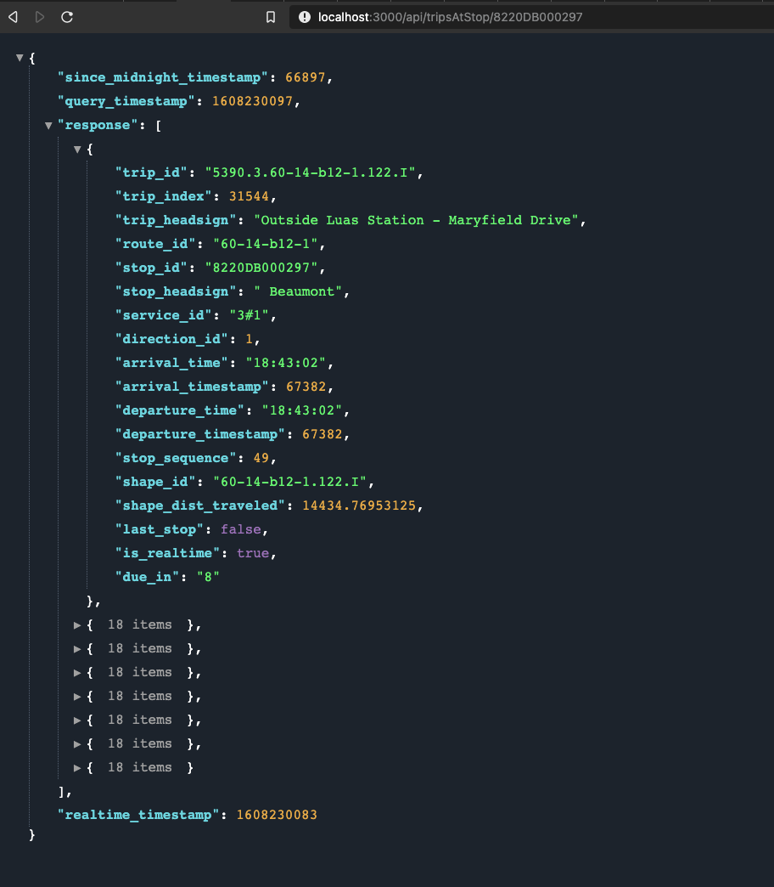
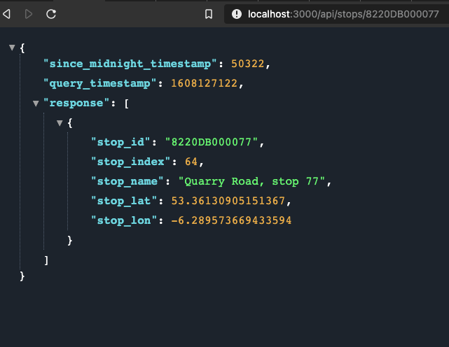
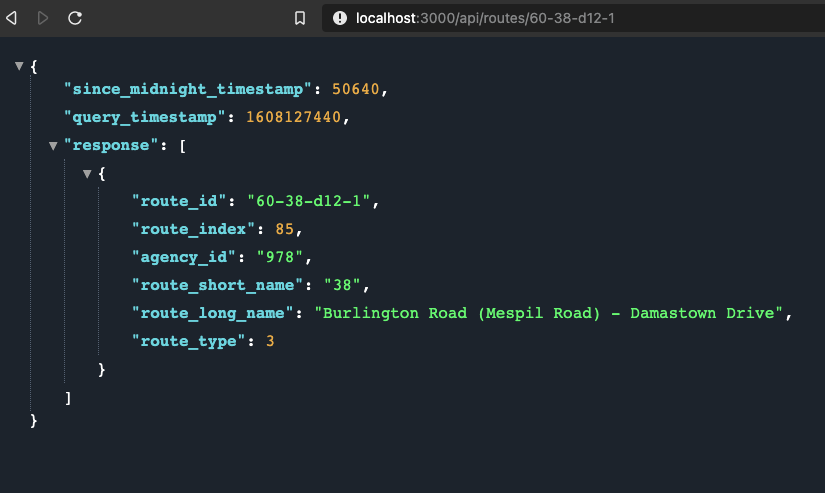
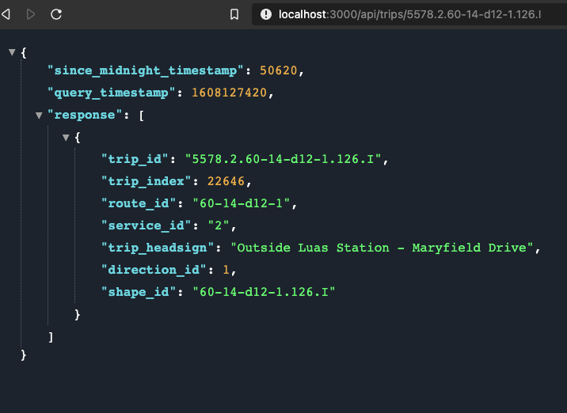
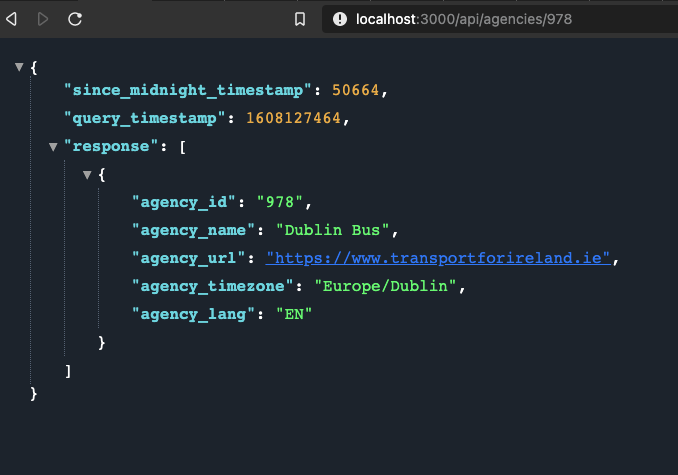
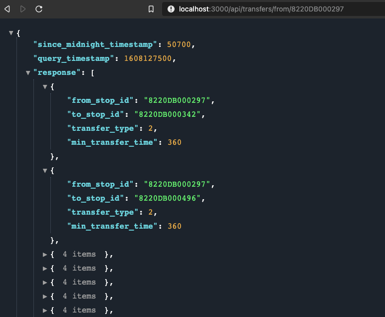
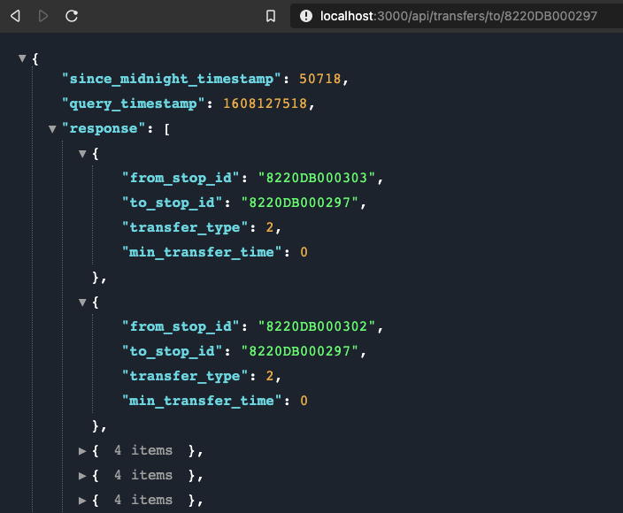

# Realtime-Transport-Updates-API
`Realtime-Transport-Updates-API` is a Node.js application that loads a [Transport For Ireland GTFS feed](https://www.transportforireland.ie/transitData/PT_Data.html) into an MSSQL docker container and exposes REST API's to consume both static GTFS schedule data and realtime updates from the [NTA GTFS-Realtime API](https://developer.nationaltransport.ie/api-details#api=gtfsr&operation=gtfsr). 

It provides queries to get incoming trips at a provided stop, stop locations, routes, queries and route shapes.

**This application is made for usage with Irish transit agency GTFS feeds and the NTA GTFS-Realtime API**, however with changes to SQL queries and the realtime plugin it can be used for transit agencies elsewhere.

## Requirements
* Nodejs v15+
* Docker

## Setup
### Docker Setup
#### Setup an MSSQL Docker container

The application downloads a GTFS feed and writes it to a [Microsoft SQL Server Docker image](https://hub.docker.com/_/microsoft-mssql-server).

In `docker-compose.yml` provide a password for the database, replacing the below placeholder:

```
SA_PASSWORD: '<YourNewStrong@Passw0rd>'
```

In the project root directory run the docker-compose file which downloads the image and runs the container:

```
docker-compose up -d
```
#### Connect to the SQL server

Use the `docker exec -it` command to start an interactive bash shell inside your running container.

```
docker exec -it docker-gtfs-db "bash"
```
Once inside the container, connect locally with [sqlcmd](https://docs.microsoft.com/en-us/sql/tools/sqlcmd-utility?view=sql-server-ver15). Sqlcmd is not in the path by default, so you have to specify the full path and enter your own password:

```
/opt/mssql-tools/bin/sqlcmd -S localhost -U SA -P "<YourNewStrong@Passw0rd>"
```

#### Create a new database
Create a new database using the following Transact-SQL command:

```sql
CREATE DATABASE gtfsdb
```
Type `GO` on a new line to execute the previous command:

```sql
GO
```

#### Download and write the GTFS feed to your Docker container
Replace `DOCKER_SQL_PASSWORD` in the below section of `.env` with the password you set:

```
# Docker SQL server container
DOCKER_SQL_USER=sa
DOCKER_SQL_PASSWORD=YourNewStrong@Passw0rd
DOCKER_SQL_SERVER=localhost
DOCKER_SQL_DATABASE=gtfsdb
```
In `src/import/config.js` add your own agency and the url of the GTFS feed you wish to download. You can find Transport for Ireland GTFS feeds [here](https://www.transportforireland.ie/transitData/PT_Data.html).

Once you have added your own configuration import the GTFS feed into your Docker container with the following command:

```
npm run import
```

## Configuration
In `.env` replace the placeholders in the GTFS-R API sections with your own configuration settings.

To use the NTA GTFS-Realtime API you will need to sign up and obtain an API key [here](https://developer.nationaltransport.ie/signup)

#### Azure SQL server configuration

If your GTFS feed is on an Azure SQL server you can specify your server config in the appropriate section.

## Usage

### Run the Application

You can run the application on the GTFS-R API test URL using:

```
npm start
```
Run the application on the GTFS-R API production URL using:

```
npm run prod
```

Then open: http://127.0.0.1:3000/api/stops/8220DB000297

## Endpoints
The below screenshots show sample query responses providing results from the GTFS static dataset, updated with realtime data where possible.

### /api/tripsAtStop/`<stop_id>`
- `since_midnight_timestamp`: Timestamp of the query as the number of seconds elapsed since midnight.
- `query_timestamp`: Unix timestamp at the time of the query
- `last-stop`: Indicates whether this stop is the last stop on the trip.
- `is_realtime`: Will be `true` if result is updated with an update from the GTFS Realtime API, otherwise `false` and using the static schedule data.
- `due_in`: The number of minutes until the scheduled arrival of the trip at the queried stop.
- `realtime_timestamp`: Unix timestamp of the moment a response was received from the GTFS Realtime API.



### /api/stops/`<stop_id>`
- `since_midnight_timestamp`: Timestamp of the query as the number of seconds elapsed since midnight.
- `query_timestamp`: Unix timestamp at the time of the query



### /api/routes/`<route_id>`
- `since_midnight_timestamp`: Timestamp of the query as the number of seconds elapsed since midnight.
- `query_timestamp`: Unix timestamp at the time of the query



### /api/trips/`<trip_id>`
- `since_midnight_timestamp`: Timestamp of the query as the number of seconds elapsed since midnight.
- `query_timestamp`: Unix timestamp at the time of the query



### /api/agencies/`<agency_id>`
- `since_midnight_timestamp`: Timestamp of the query as the number of seconds elapsed since midnight.
- `query_timestamp`: Unix timestamp at the time of the query



### /api/shapes/`<shape_id>`
- `since_midnight_timestamp`: Timestamp of the query as the number of seconds elapsed since midnight.
- `query_timestamp`: Unix timestamp at the time of the query


### /api/transfers/from/`<stop_id>`
- `since_midnight_timestamp`: Timestamp of the query as the number of seconds elapsed since midnight.
- `query_timestamp`: Unix timestamp at the time of the query



### /api/transfers/to/`<stop_id>`
- `since_midnight_timestamp`: Timestamp of the query as the number of seconds elapsed since midnight.
- `query_timestamp`: Unix timestamp at the time of the query



## Testing

### Test database for docker

SQL query tests are run against the GTFS dataset provided as of 16th December 2020. For this purpose a Docker image containing this GTFS feed in an mssql database can be found [here](https://hub.docker.com/repository/docker/matthewoleary/irish-transport-gtfs).

To successfully run all tests you will need to download and run the test database in a docker container. You can do so by changing `docker-compose.yml` to the below:

```
version: '3.7'
services:
    docker-gtfs-db:
        container_name: docker-gtfs-db-testing
        image: matthewoleary/irish-transport-gtfs:20201216
        ports:
            - '1433:1433'
        environment: 
            SA_PASSWORD: 'YourStrong@Passw0rd'
            ACCEPT_EULA: 'Y'
```

And running the following command:

```
docker-compose up -d
```

Note: After setup, the `SA_PASSWORD` environment variable has the above default value `YourStrong@Passw0rd`. **It is strongly recommended you change this password by following the guide to do so provided by Microsoft [here](https://docs.microsoft.com/en-us/sql/linux/quickstart-install-connect-docker?view=sql-server-ver15&pivots=cs1-bash#sapassword****).**

The below example replaces the old password `YourStrong@Passw0rd`, with your own password value replacing the placeholder `<YourNewStrong@Passw0rd>`.

```bash
sudo docker exec -it docker-gtfs-db-testing /opt/mssql-tools/bin/sqlcmd \
   -S localhost -U SA -P "YourStrong@Passw0rd" \
   -Q 'ALTER LOGIN SA WITH PASSWORD="<YourNewStrong@Passw0rd>"'
```

### Run Tests


The following command runs tests on the application:

```
npm test
```

### Linting
The following command runs linting on the application:

```
npm run lint
```